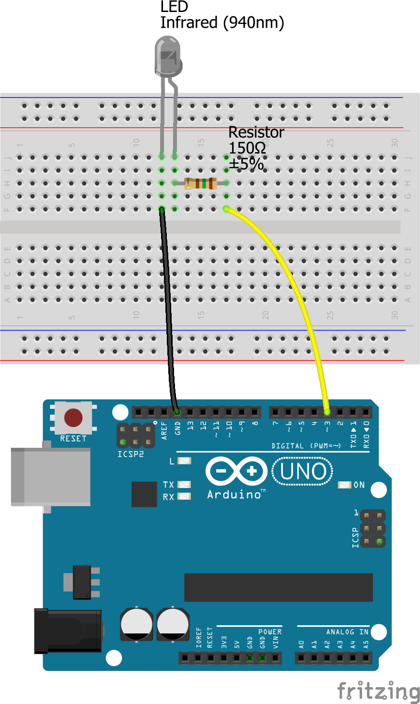

# Arduino IR codes for Kallox/Metechs motorized curtains/blinds

## Description

Here is an Arduino sketch that you can upload to an Arduino Uno, to operate the Kallox/Metechs motorized curtains/blinds, which can be purchased at a large number of web shops, for example at:
- https://www.metechs.com/store/index.php?main_page=product_info&cPath=18&products_id=106
- https://www.pahedomotica.nl/product-categorie/gordijnrails/kallox-elektrische-gordijnrail/
- https://www.autogordijn.nl/product/rolgordijn-infrarood/
- https://www.robbshop.nl/z-wave-gordijn-systeem-kallox-1-14-6-14mtr

These Chinese products are pretty picky about the timing of the IR signals, but after a few evenings of experimenting I found the correct timings, which have proven to work every time I tested.

I only provide the 'Open', 'Close' and 'Stop' codes. There are also codes for '1', '2' ... '8' but I couldn't be bothered to find those, as I do not need them.

You need to install the library '[IRremote](https://github.com/z3t0/Arduino-IRremote)' in the Arduino IDE (menu 'Sketch' --> 'Include Library' --> 'Manage Libraries...' then search for "IRremote", click on it and press the 'Install' button. I tested with version 2.2.3 .

With some very simple adaptations it is possible to upload this sketch to an ESP-based board like [Wemos (LOLIN) D1 mini (Lite)](https://www.wemos.cc/en/latest/d1/index.html) . For that you would need to install the library '[IRremoteESP8266](https://github.com/esp8266/Basic/tree/master/libraries/IRremoteESP8266)'; I am using version 1.0.0 but probably a more recent version will work fine.

Have fun with it!

## Schematic

## See also

- http://www.hifi-remote.com/forums/viewtopic.php?t=13140
- http://www.hifi-remote.com/forums/viewtopic.php?t=13374
- http://www.hifi-remote.com/forums/viewtopic.php?t=13720
- http://www.hifi-remote.com/forums/viewtopic.php?p=120209
- http://www.remotecentral.com/cgi-bin/mboard/rc-discrete/thread.cgi?6360
